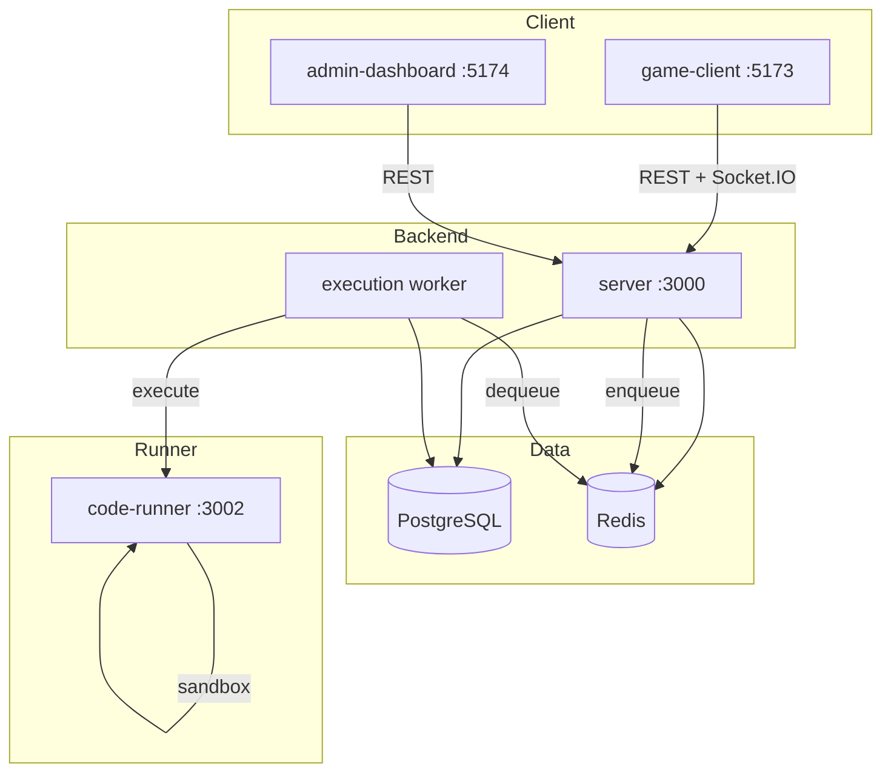

# Architecture

## Overview

Code to Escape is a pnpm + Turborepo monorepo with five workspaces (`game-client`,
`admin-dashboard`, `server`, `code-runner`, `e2e`) and five shared packages.



## Applications

| App               | Port | Purpose                              |
| ----------------- | ---- | ------------------------------------ |
| `game-client`     | 5173 | Player-facing Vite + React SPA       |
| `admin-dashboard` | 5174 | Admin Vite + React SPA               |
| `server`          | 3000 | Express API + Socket.IO              |
| `code-runner`     | 3002 | Internal sandboxed execution service |
| `e2e`             | —    | Playwright end-to-end tests          |

## Shared Packages

| Package           | Purpose                           |
| ----------------- | --------------------------------- |
| `packages/shared` | APP_NAME, API_BASE_PATH constants |
| `packages/types`  | Shared TypeScript types           |
| `packages/ui`     | Shared React UI primitives        |
| `packages/utils`  | Pure utility functions            |
| `packages/config` | Shared ESLint / TS configs        |

## Frontend

- Feature-based folder structure under `apps/game-client/src/features`
- React Router v7 for routing
- Zustand v5 for auth state
- React Query for server state (planned)
- Monaco Editor (npm package, lazy-loaded) for code editing
- Framer Motion for animations

### Game Client Routes

| Path                | Component             | Auth      |
| ------------------- | --------------------- | --------- |
| `/`                 | HomePage              | public    |
| `/explore`          | ChallengeListPage     | public    |
| `/login`            | LoginPage             | public    |
| `/register`         | RegisterPage          | public    |
| `/forgot-password`  | ForgotPasswordPage    | public    |
| `/reset-password`   | ResetPasswordPage     | public    |
| `/dashboard`        | DashboardPage         | protected |
| `/profile`          | ProfilePage           | protected |
| `/settings`         | SettingsPage          | protected |
| `/challenges`       | ChallengeListPage     | protected |
| `/challenges/:slug` | ChallengePlayerPage   | protected |
| `/me`               | redirect → /dashboard | —         |

## Backend

- Modular Express architecture under `apps/server/src/modules`
- Each module: `routes.ts` (thin), `controller.ts` (thin), `service.ts` (business logic), `schema.ts` (Zod)
- Socket.IO attached to HTTP server — emits real-time submission/achievement events
- Prisma ORM for PostgreSQL
- ioredis for Redis connectivity

### Server Modules

| Module         | Routes prefix                 | Purpose                                        |
| -------------- | ----------------------------- | ---------------------------------------------- |
| `health`       | `/api/v1/health`              | Liveness + readiness checks                    |
| `auth`         | `/api/v1/auth`                | Register, login, OAuth, token rotation         |
| `player`       | `/api/v1/player`              | Dashboard, worlds, leaderboard, notifications  |
| `challenges`   | `/api/v1/challenges`          | Browse + submit + poll execution               |
| `daily-reward` | `/api/v1/player/daily-reward` | Streak-based daily rewards                     |
| `admin`        | `/api/v1/admin`               | Full CRUD + audit log (ADMIN/SUPER_ADMIN only) |

## Execution Pipeline

Challenge submissions are persisted as immutable `Submission` records and their IDs are pushed
onto Redis (`cte:execution:queue`). The HTTP service never compiles or runs player code.

Run `pnpm dev:worker` (or `pnpm --filter @code-to-escape/server worker`) as a separate process;
it:

1. Atomically claims a `QUEUED` submission via a guarded `updateMany`, so a Redis
   redelivery or a second worker cannot judge and pay out the same submission twice
2. Dequeues submission IDs from Redis
3. Sends code to the internal `CODE_RUNNER_URL` service
4. Validates and bounds every value from the runner response
5. Saves individual test results atomically via Prisma transaction
6. Applies XP/level/coin/rank updates in the same transaction
7. Updates the Redis leaderboard
8. Evaluates achievement unlock conditions
9. Emits a `submission:completed` Socket.IO event to the player

When the runner is unreachable the judge throws and the submission is recorded as
`INTERNAL_ERROR`. There is deliberately no fallback verdict and no `NODE_ENV`-gated stub
in production code: a green test run must never be produced by a fabricated result.

The runner must be an isolated internal service with:

- No outbound network access
- Read-only filesystem
- Dropped Linux capabilities
- Process limits
- Per-request CPU, memory, and wall-clock limits

## Achievement Engine

`apps/server/src/modules/challenges/achievement.service.ts`

Trigger → evaluate → unlock → award in one atomic transaction.

Supported triggers: `FIRST_LOGIN`, `FIRST_CHALLENGE_SOLVED`, `CHALLENGES_SOLVED`, `XP_REACHED`,
`LEVEL_REACHED`, `STREAK_REACHED`, `DAILY_REWARD_STREAK`, `PERFECT_SUBMISSION`.

Achievement slugs follow a prefix naming convention (e.g. `challenges_solved_10`) so the engine
can efficiently filter candidates. The admin UI enforces this when creating achievements.

## Leaderboard

- Two sorted sets in Redis: `cte:leaderboard:global` and `cte:leaderboard:weekly`
- Populated at server startup via `reconcileLeaderboard()` if empty (seeds top 1000 profiles by XP)
- Updated in real-time on every accepted submission and daily reward claim
- Weekly leaderboard uses weekly-scoped Redis keys (auto-reset by TTL)

## Admin Audit Log

Every write admin action (role change, suspend, publish, etc.) writes an immutable
`AdminAuditLog` record via `apps/server/src/shared/lib/audit.ts`. The `/admin/audit` endpoint
provides a paginated read view.

## Security

- JWT access tokens (15-minute TTL) + refresh token rotation with family revocation
- Passwords hashed with bcrypt
- Reset tokens stored as SHA-256 hashes only
- Helmet.js security headers (CSP, X-Frame-Options, Referrer-Policy, etc.)
- CORS allow-list from `CORS_ORIGIN` env var
- Rate limiting: 200 req/15 min general, 20 req/15 min auth, 10 req/min submissions
- `getSecret()` enforces that JWT/refresh secrets are not placeholder values in production
- Admin routes require `ADMIN` or `SUPER_ADMIN` role checked on every request (server-side)
- Hidden test cases never sent to clients

## Deployment

Production deployment uses Docker Compose with Nginx as reverse proxy. See `Deployment.md`.

```
docker compose up -d
```

Services: `postgres`, `redis`, `server`, `worker`, `code-runner`, `game-client`, `admin-dashboard`, `nginx`
