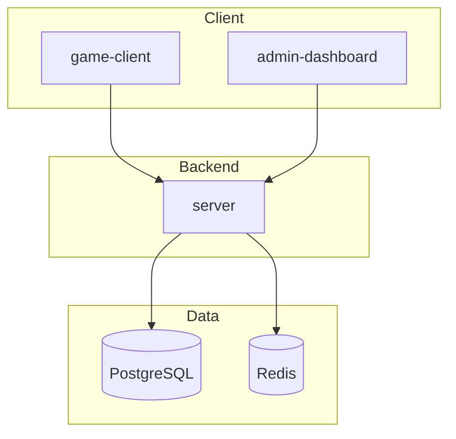

# Architecture

## Overview

Code to Escape is a pnpm + Turborepo monorepo with three applications and six shared packages.

## Frontend

- Feature-based folder structure under `apps/game-client/src/features`
- React Router for routing
- Zustand for state (Day 3+)
- React Three Fiber for 3D rendering

## Backend

- Modular Express architecture under `apps/server/src/modules`
- Socket.io attached to HTTP server (events planned for Day 8)
- Prisma ORM for PostgreSQL
- ioredis for Redis connectivity

## Deployment

Production deployment uses Docker Compose with Nginx as reverse proxy. See `Deployment.md`.
